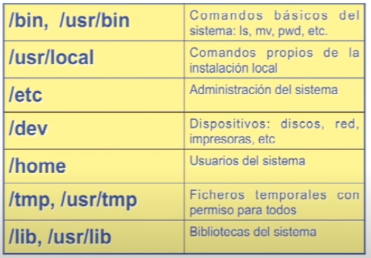
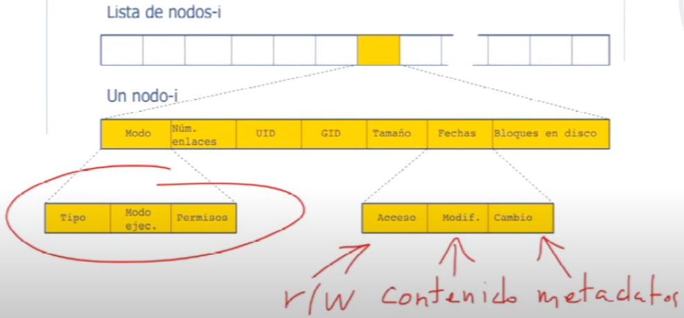
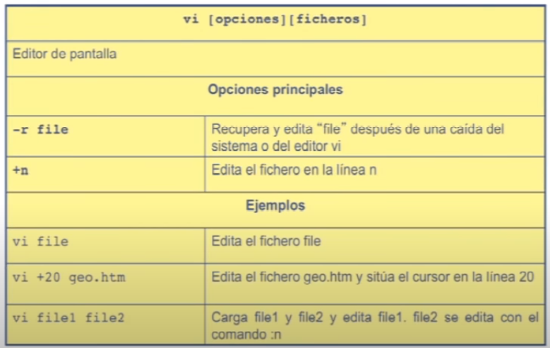
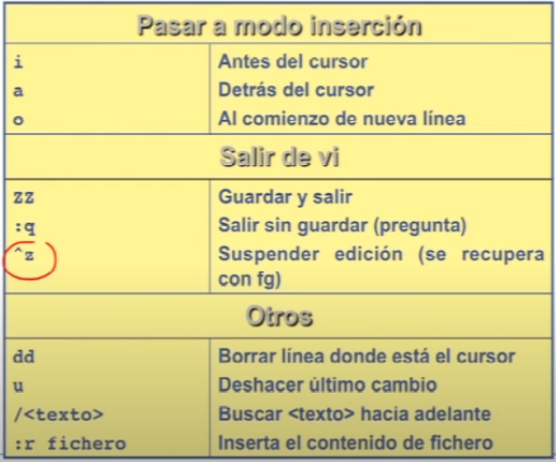

# Gestión de proyectos Software con Git y GitHub (3.ª edición) - MiradaX

## Módulo 0. Introducción Al Curso.

### [Tema 1. Introducción al curso y al programa](https://www.youtube.com/watch?v=w0hmxHzA_eM)

**Git**
- Permite gestionar las versiones de un programa a lo largo de su vida, así como el desarrollo en equipo.

### [Tema 2. Introducción a Visual Studio Code](https://www.youtube.com/watch?v=X_B9j23ZmDk)

### [Tema 3. Visual Studio Code - Espacio de trabajo](https://www.youtube.com/watch?v=KQijcOHXKl0)

## Módulo 1. Introducción A UNIX Y A Su Sistema De Archivos

> Este modulo introduce el sistema de archivos del Sistema Operativo UNIX/Linux para los que no lo conocen. Además se describen los comandos mas importantes.
> 
> UNIX es probablemente el sistema operativo mas popular entre los desarrolladores de software. Además Git y GitHub, como muchas otras herramientas de Ingeniería de Software, se diseñaron para el interfaz de comandos textuales de UNIX y aunque existen interfaces gráficos, suele ser necesario acceder al interfaz textual para las operaciones mas complejas. 
>
> Este curso incluye esta breve introiducción a UNIX/Linux, para que los que todavía no lo conocen puedan familiarizarse.

### [Tema 1. Introducción al sistema operativo Unix](https://www.youtube.com/watch?v=5xXYqoyKClk)

### [Tema 2. El sistema de archivos de Unix I](https://youtube.com/watch?v=0BSxwpQ5c3E)

**El sistema de archivos**
- Los ordenadores pueden almacenar información de forma persistente en distintos medios físicos: cinta/disco magnético, disco óptico, disco SSD, etc.
- El **sistema operativo** presenta una visión lógica del almacenamiento. Su unidad de almacenamiento es el **fichero** o **archivo**.
- **Fichero**: conjunto de información relacionada que se almacena en un dispositivo secundario (persitente) y a la cual se asigna un nombre.
  - Es la unidad lógica de almacenamiento secundario.
  - Normalmente es una secuencia simple de bytes de longitud finita.
  - **Unix**
    - Pueden contener textos, documentos, código fuente, etc.
    - Representan también dispositivos físicos, buffers, sockets, etc.
    - No impone estructura ni interpretación a la información contenida en el fichero. Dependerá de la aplicación que lo utilice.
- **Directorios**: **nodos** del sistema de archivos y contienen otros nodos del sistema (ficheros/directorios)
  - Ficheros que contienen información sobre cómo encontrar otros ficheros.
  - Todo directorio contiene al menos dos subdirectorios
    - Él mismo (.)
    - Su antecesor (..)
- **Sistema de archivos**: mecanismo sw que permite crear, almacenar, recuperar, proteger y gestionar ficheros.
  - Implementado en el núcleo (kernel).
  - Asocia a los ficheros **información adicional** (metadatos) como permisos de acceso, atributos, etc.



### [Tema 3. El sistema de archivos de Unix II](https://www.youtube.com/watch?v=TzyWzGhoHIg)

**Estructura del sistema de archivos**
- Árbol de nodos: ficheros y directorios.
- Directorio: fichero que contiene una lista de nodos, incluyendo una referencia a si mismo y a su ancestro.
- UNIX guarda el sistema de archivos en disco como una lista de nodos: **i-nodos**.

**Los nodos índice (i-nodos)**
- Representación interna de un fichero en UNIX.
- Contiene info de localización en disco del contenido del fichero e información adicional para la gestión y manipulación del fichero en el sistema de archivos.
- Una entrada entrada en un directorio (fichero) consta del nombre del fichero + el número de i-nodo.

**Información de un i-nodo**
- Modo
  - Tipo de fichero
  - Modo de ejecución
  - Permisos de acceso
- Número de enlaces al fichero
- Identificación de propietario y grupo
- Tamaño del fichero en bytes
- Fecha y hota del último acceso, modificación y cambio
- Dispositivo donde está almacenado el fichero.
- Dirección de los bloques de disco que componen el fichero.
- Tamaño óptimo del bloque de disco.
- Nº de bloques de disco asignados al fichero.

```bash
# Lista todos los ficheros (a) + nodo índice (i)
$ ls -ai
```

- **Modo de fichero**
  - Entero de 16 bits que codifica el tipo de fichero, forma de ejecución y permisos de acceso.
  - Tipo
    - Normal (-)
    - Directorio (d)
    - Fichero pipe (p)
    - Enlace simbólico (l)
    - Dispositivo de almacenamiento por caracteres (c)
    - Dispositivo de almacenamiento por bloques (b)
  - Permisos de acceso
    - Lectura (r), escritura (w), ejecución (x)
    - Tipos de usuario: user, group y others
  - Metacaracteres
    - \* (asterisco): cualquier cadena de caracteres. Ejemplo: rm*.html 
    - ?: cualquier caracter individual. Ejemplo: ls modulo.?
    - [c1,c2..,cn]: cualquier carácter dentro de una enumeración/rango. Ejemplo: ls capitulo[1-9]



### [Tema 4. El sistema de de archivos de Unix III](https://www.youtube.com/watch?v=wd1Zq7vC3fE)

**VI**




### [Tema 5. Sesión práctica con ficheros y directorios](https://www.youtube.com/watch?v=4zfr6j-guDs)
