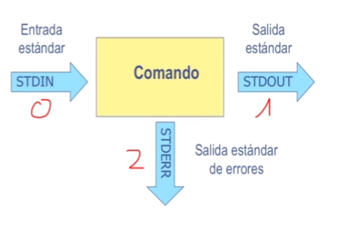
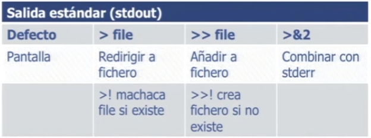
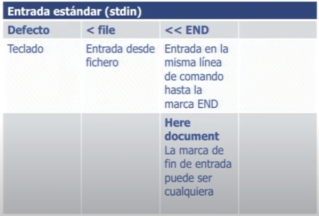
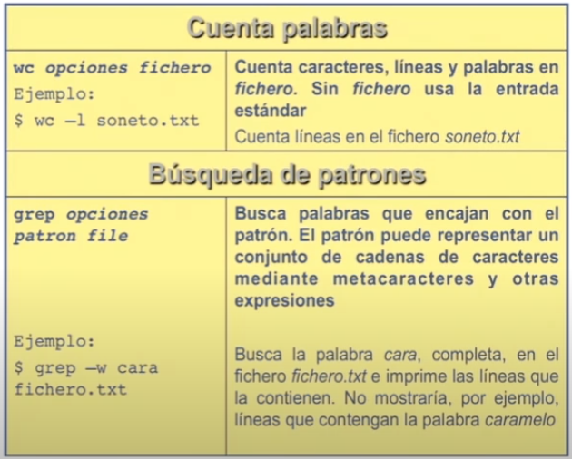
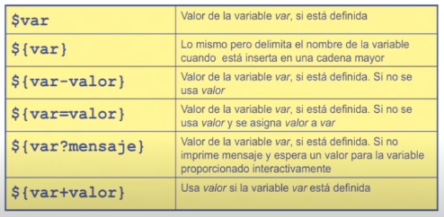

# Gestión de proyectos Software con Git y GitHub (3.ª edición) - MiradaX

## Módulo 0. Introducción Al Curso.

### [Tema 1. Introducción al curso y al programa](https://www.youtube.com/watch?v=w0hmxHzA_eM)

**Git**
- Permite gestionar las versiones de un programa a lo largo de su vida, así como el desarrollo en equipo.

### [Tema 2. Introducción a Visual Studio Code](https://www.youtube.com/watch?v=X_B9j23ZmDk)

### [Tema 3. Visual Studio Code - Espacio de trabajo](https://www.youtube.com/watch?v=KQijcOHXKl0)

## Módulo 1. Introducción A UNIX Y A Su Sistema De Archivos

> Este modulo introduce el sistema de archivos del Sistema Operativo UNIX/Linux para los que no lo conocen. Además se describen los comandos mas importantes.
> 
> UNIX es probablemente el sistema operativo mas popular entre los desarrolladores de software. Además Git y GitHub, como muchas otras herramientas de Ingeniería de Software, se diseñaron para el interfaz de comandos textuales de UNIX y aunque existen interfaces gráficos, suele ser necesario acceder al interfaz textual para las operaciones mas complejas. 
>
> Este curso incluye esta breve introiducción a UNIX/Linux, para que los que todavía no lo conocen puedan familiarizarse.

### [Tema 1. Introducción al sistema operativo Unix](https://www.youtube.com/watch?v=5xXYqoyKClk)

### [Tema 2. El sistema de archivos de Unix I](https://youtube.com/watch?v=0BSxwpQ5c3E)

**El sistema de archivos**
- Los ordenadores pueden almacenar información de forma persistente en distintos medios físicos: cinta/disco magnético, disco óptico, disco SSD, etc.
- El **sistema operativo** presenta una visión lógica del almacenamiento. Su unidad de almacenamiento es el **fichero** o **archivo**.
- **Fichero**: conjunto de información relacionada que se almacena en un dispositivo secundario (persitente) y a la cual se asigna un nombre.
  - Es la unidad lógica de almacenamiento secundario.
  - Normalmente es una secuencia simple de bytes de longitud finita.
  - **Unix**
    - Pueden contener textos, documentos, código fuente, etc.
    - Representan también dispositivos físicos, buffers, sockets, etc.
    - No impone estructura ni interpretación a la información contenida en el fichero. Dependerá de la aplicación que lo utilice.
- **Directorios**: **nodos** del sistema de archivos y contienen otros nodos del sistema (ficheros/directorios)
  - Ficheros que contienen información sobre cómo encontrar otros ficheros.
  - Todo directorio contiene al menos dos subdirectorios
    - Él mismo (.)
    - Su antecesor (..)
- **Sistema de archivos**: mecanismo sw que permite crear, almacenar, recuperar, proteger y gestionar ficheros.
  - Implementado en el núcleo (kernel).
  - Asocia a los ficheros **información adicional** (metadatos) como permisos de acceso, atributos, etc.


### [Tema 3. El sistema de archivos de Unix II](https://www.youtube.com/watch?v=TzyWzGhoHIg)

**Estructura del sistema de archivos**
- Árbol de nodos: ficheros y directorios.
- Directorio: fichero que contiene una lista de nodos, incluyendo una referencia a si mismo y a su ancestro.
- UNIX guarda el sistema de archivos en disco como una lista de nodos: **i-nodos**.

**Los nodos índice (i-nodos)**
- Representación interna de un fichero en UNIX.
- Contiene info de localización en disco del contenido del fichero e información adicional para la gestión y manipulación del fichero en el sistema de archivos.
- Una entrada entrada en un directorio (fichero) consta del nombre del fichero + el número de i-nodo.

**Información de un i-nodo**
- Modo
  - Tipo de fichero
  - Modo de ejecución
  - Permisos de acceso
- Número de enlaces al fichero
- Identificación de propietario y grupo
- Tamaño del fichero en bytes
- Fecha y hota del último acceso, modificación y cambio
- Dispositivo donde está almacenado el fichero.
- Dirección de los bloques de disco que componen el fichero.
- Tamaño óptimo del bloque de disco.
- Nº de bloques de disco asignados al fichero.

```bash
# Lista todos los ficheros (a) + nodo índice (i)
$ ls -ai
```

- **Modo de fichero**
  - Entero de 16 bits que codifica el tipo de fichero, forma de ejecución y permisos de acceso.
  - Tipo
    - Normal (-)
    - Directorio (d)
    - Fichero pipe (p)
    - Enlace simbólico (l)
    - Dispositivo de almacenamiento por caracteres (c)
    - Dispositivo de almacenamiento por bloques (b)
  - Permisos de acceso
    - Lectura (r), escritura (w), ejecución (x)
    - Tipos de usuario: user, group y others
  - Metacaracteres
    - \* (asterisco): cualquier cadena de caracteres. Ejemplo: rm*.html 
    - ?: cualquier caracter individual. Ejemplo: ls modulo.?
    - [c1,c2..,cn]: cualquier carácter dentro de una enumeración/rango. Ejemplo: ls capitulo[1-9]


### [Tema 4. El sistema de de archivos de Unix III](https://www.youtube.com/watch?v=wd1Zq7vC3fE)

**VI**


### [Tema 5. Sesión práctica con ficheros y directorios](https://www.youtube.com/watch?v=4zfr6j-guDs)

## Módulo 2. La Interfaz De Usuario De UNIX

> Este modulo introduce el interfaz de usuario, mas conocido como shell, del Sistema Operativo UNIX/Linux para los que no lo conocen. Además se describen los comandos mas importantes.
> 
> UNIX es probablemente el sistema operativo mas popular entre los desarrolladores de software. Además Git y GitHub, como muchas otras herramientas de Ingeniería de Software, se diseñaron para el interfaz de comandos textuales de UNIX y aunque existen interfaces gráficos, suele ser necesario acceder al interfaz textual para las operaciones mas complejas. 
> 
> Este curso incluye esta breve introiducción a UNIX/Linux, para que los que todavía no lo conocen puedan familiarizarse.

### [Tema 1. La interfaz de usuario Unix I](https://www.youtube.com/watch?v=sWWCEX7f9qI)

### [Tema 2. La interfaz de usuario Unix II](https://www.youtube.com/watch?v=vcHTpv5jb4k)

**Entrada/salida de comandos**
- Los argumentos de un comando suelen indicar la fuente de información de entrada (o el destino de los resultados de salida)
- Además de los argumentos, un comando UNIX típico tiene definidos unos canales (ficheros) de entrada y salida por defecto:
  - Entrada estándar (por defecto el teclado)
  - Salida estándar (por defecto la pantalla)
  - Salida estándar de errores (por defecto la pantalla)



**Entradas de un comando**
- Opciones y argumentos
- Ficheros predefinidos
  - Personalización de sesión (.login)
  - Configuración del propio comando (.exrc para vi)
- Variables de entorno
  - TERM, PATH, PAGER, etc.
- Entrada estándar

**Salida de un comando**
- Ficheros
  - Nombre dado como argumento del comando
  - Nombre por defecto
- Salida estándar
- Salida estándar de errores
- Valor de retorno a la shell
  - 0 (cero) es **ejecucción con éxito**.
  - Cualquier otro valor entero es ejecución con errores.

**Redirección de entrada/salida**
- Los canales de entrada y salida estándar de un comando se asocian por defecto al terminal de usuario, pero pueden asociarse a cualquier otro fichero (redirección de entrada/salida).
- La salida estándar de un comando puede asociarse con la entrada estándar de otro para conseguir la composición de comandos en cadena (pipeline).

```bash
# Redirigir salida estándar
$ cal > calendario

# Añadir salida a fichero preexistente
$ cal >> calendario

# Redirigir salida estándar a salida de error
$ echo "Error" >&2

# Redirigir entrada estándar 
$ wx < poema

# Entrada en la misma línea de comando (here document)
$ wx << fin
Texto que se ha de introducir
Con múltiples líneas
el cual añadirá al texto
fin # Ctrl-D para finalizar

# Secuencia de comandos
$ date; who

# Encadenamiento de comandos con un solo flujo de información (pipeline)
$ grep -i amor ./poema | wc -l
```





### [Tema 3. La interfaz de usuario Unix III](https://www.youtube.com/watch?v=gr574VsZKBA)

**Variables de la shell**
- **Siempre** deben comenzar con una letra y les puede seguir otras letras, números o subrayado.
- Asignar variables **sin espacios** entre el nombre, el igual, y el valor.

```bash
# Variable sin espacios
$ nombre="Manu"
$ echo $nombre
$ echo "${nombre} Pérez"
$ echo "${nombre}el Pérez"
```

**Tipos de variables**
- **Ordinaria**: locales de propósito general.
- **De entorno**: describen el contexto de ejecución y se heredan. (TERM, PATH, HOSTNAME, USER, etc.)
- **Especiales de la shell (posicionales)**: configuran el entorno de la propia shell. 
  - <comando> <arg1> <arg2> ...=> $0 $1 $2

```bash
$ cc -o programa parte1.c parte2.c
$0 # cc
$1 # -o
$2 # programa
$3 # parte1.c
$4 # parte2.c
```



**Inicialización de la shell**
- Inicialización de la sesión para un único usuario: **$HOME/.profile**
- Inicialización de la sesión común para todos: **/etc/profile**

**Tipos de shell**
- Interactiva: permiten interactuar al usuario con el sistema operativo.
  - **Login shell**: la que se inicia tras el proceso de login.
  - **Non-login shell**: una shell ejecutada como comando desde otra shell. Hereda el entorno y ejecuta ficheros de inicialización específicos. La shell de una ventana de terminal en Ubuntu es una **non-login shell**
- **No interactiva**: entorno de ejecución de un comando lanzado por una shell interactiva, de la que hereda el entorno.

**Ficheros para particularización de comienzo y fin de sesión**
- **/etc/profile**: inicialización global para login shell.
- **/etc/basrc**: configuración global.
- **$HOME/.bash_profile**: ejecutada al comienzo de sesión.
- **$HOME/.bashrc**: ejecutada al comienzo de una shell.
- **$HOME/.bash_logout**: ejecutada al realizar un  logout.

### [Tema 4. Sesión práctica sobre interfaz de usuario Unix I](https://www.youtube.com/watch?v=ZfjnfqaXySc)
### [Tema 5. Sesión práctica sobre interfaz de usuario Unix II](https://www.youtube.com/watch?v=PajiFDGZ-Xk)

## Módulo 3. Repositorios Locales Y Remotos, Directorio De Trabajo Y Commit

> Este módulo introduce la herramienta Git y el portal GitHub, asi como los conceptos de versión o commit, rama master de desarrollo, directorio de trabajo,  restauración de versión o checkout, .. en los que se basa la gestión de versiones de un proyecto software.
>
> La rama master es la rama principal de un proyecto que se crea automaticamente al crear un nuevo repositorio vacío. Es la rama donde se deben guardar las versiones principales de un proyecto de desarrollo software.
> 
> Se describen los comandos Git mas importantes (init, add, status, commit, checkout, diff, log, mv, rest, rm, ..) y además se ilustra el uso más habitual de Git para gestionar proyectos en repositorios locales y remotos.
> 
> El repositorio local (o de trabajo) es un repositorio guardado normalmente en una carpeta del ordenador de trabajo local de un desarrollador. Es donde un desarrollador edita y prueba los programas que está desarrollando. El repositorio remoto es un repositorio, que en nuestro caso está en GirtHub, que actua de backup de trabajo de un desarrollador. 
> 
> Este modulo incluye también un resumen de los comandos de Git que se van a ver a lo largo de curso. Es un documento que se puede utilizar como ayuda para recordar la larga lista de comandos y opciones que hay en Git. Git es una herramienta muy potente y compleja y tener un documento con las recetas mas habituales como este, facilita mucho el trabajo al principio. Esta pensado para imprimirlo (a doble cara y a 4 transparencias por cara), de forma que pueda ser consultado con facilidad o se puedan añadir notas.
> 
> También se introduce el uso de Visual Studio Code para inspeccionar y gestionar repositorios Git utilizando el plugin "Git Graph" que es muy sencillo de utilizar y muestra muy bien las versiones de un desarrollo y su grafo de commits.

### [Tema 1. Introducción a Git y a sus comandos](https://www.youtube.com/watch?v=PM8bjjVgoWY)

- Git es un gestor de control de versiones de software.
- Git es un comando de UNIX/Linux

```bash
$ git --version # indica la versión instalada de GIT.
$ git --help # Equivale a git help y muestra lista de los comandos de git más habituales.
$ git init # git es un meta-comando, donde le primer parámetro (init) la operación solicitada.
# Los comandos add, bisect, branch, checkout... invocan distintas operaciones.

# El comando git config configura git con las credenciales del desarrollador
$ git config --global user.name 'Nombre Apellido'
$ git config --global user.email direccion@email.com

# Consultar el valor de todas las opciones configuradas
$ git config --list

# Consultar el valor de una opción
$ git config user.name
```

### [Tema 2. El repositorio local y el directorio de trabajo: add, checkout, diff, init, log, mv, reset, rm, status y commit](https://www.youtube.com/watch?v=wH5ESFOtWlM)

**Repositorio local**
- Repositorio con un **directorio de trabajo asociado**, donde se trabaja en un proyecto y se guardan sus versiones (commits)
- Unas versiones corrigen errores, otras añaden funcionalidades, adaptan nuevo sw/hw, etc.

**Commit o versión**
- Instantánea del estado de los ficheros del proyecto, que puede restaurarse.
  - Algunos commits se etiquetan con tags especiales de versión (v1, v1.3, etc)

**Rama**
- Secuencia de commits, ordenadas por fechas, que soportan un desarrollo.
  - Los nuevos commits se añaden al final de la rama activa (donde se desarrolla).
- La **rama principal** se denomina **master**.

**Directorio de trabajo**
- Directorio donde se crean las versiones del proyecto: código fuente, datos, etc.
  - Se denomina también área o espacio de trabajo (*workspace*)
    - También se denomina así la información guardada en un commit.

**Comando git init**
- Transforma un directorio en un **directorio de trabajo Git**.
  - Añadiendo el repositorio de commits al directorio. Lo convierte en un directorio de trabajo Git.
  - El subdictorio oculto **.git** guarda los commits y sus relaciones.
  - Los comandos git son más sencillos de invocar en el directorio de trabajo (cd)

**Nombre o identificador de commit**
- **git commit** asigna un identificado **único** a cada nuevo commit.
  - El ID actúa como nombre o referencia única del commit.
    - Ningún otro commit en ningún repositorio poseerá el mismo id.
    - Garantiza la integridad del commit. Igualdad de ids implica igualdad de commits.
    - Número hexadecimal de 40 dígitos generado como clave de hash SHA1

**Índice** (staging area, index)
- Registro de cambios del directorio de trabajo a incluir en el próximo commit.
  - Los cambios no registrado en el índice no se incluyen al generar un nuevo commit.
- Los ficheros no modificados del commit anterior permanecen en el siguiente commit.

**Registra en el índice los ficheros indicados**
```bash
$ git add . # registra en el índice todos los ficheros nuevos o modificados
$ gi add LICENSE README.md # registra los ficheros LICENSE README.md en el índice
```
**Extra ficheros del índice (deshace git add)**
```bash
$ git reset . # extra del índice todos los ficheros
$ git reset LICENSE # extrae el fichero LICENSE del índice
```
**Genera un nuevo commit con lo registrado en el índice**
```bash
$ git commit -m "Descripción" # guarda nuevo commit con mensaje o título "Descripción"
$ git commit # guarda nuevo commit y abre un editor para crear el mensaje de este
$ git commit --amend -m "Descripción" # modifica el último commit con lo registrado en el índice. CAMBIA el ID del COMMIT.
```

**Muestra el estado de los ficheros del directorio de trabajo respecto al commit anterior**
- **Estado de los ficheros**
  - **modified**: modificados respecto al commit anterior.
  - **untracked**: no existentes en el commit anterior.
  - **staged**: registrados para el próximo commit.
```bash
$ git status
$ git status -s # estado en formado compacto


# Diferencias con commit anterior o entre commits
$ git diff

# contexto: se muestra en negro (no modificado)
# línea añadida: en verde y comienza por +
# línea eliminada: en rojo y comienza por -

$ git diff # muestra cambios de los ficheros modified
$ git diff file1, file2 # muestra cambios (si hubiera) de file1 y file2

# Mostrar cambios en ficheros staged respecto al commit anterior
$ git diff --cache # muestra cambios de los ficheros staged
$ git diff --cache file1, file2 # muestra cambios (si los hubiera) de file1 y file2

# Mostrar cambios entre 2 commits
$ git diff 97d75 master # muestra cambios entre 97d75 y primer commit de master
$ git diff 97d75 master --fiche1 # muestra cambios en fich1 entre 97d75 y el primer commit de master
```

- **Opciones interesantes**
  - **-b**: comparación no condiserada blancos, ni líneas vacías.
  - **--name-status**: muestra solo nombres de ficheros y su estado (sin diferencias)
  - **name-only**: muestra solo nombres de ficheros (sin diferncia)
  - **--stat** o **--numstat**: muestra estadísticas de cambios (sin diferencias)
  - **--unified=2000**: muestra 2000 líneas de contexto (probablemente todo el fichero)

**Más comandos**
- git mv old_file new_file
  - Cambia el nombre de un fichero en el directorio de trabajo (y en el índice)

```bash
$ git mv file1.js fil2.js 
```

- git rm file1, file2, ...
  - Borra los ficheros indicados del directorio de trabajo y registra lo borrado en el índice

```bash
$ git rm file1.js fil2.js 
```

- git rm --cached file1, file2, ...
  - Borra los ficheros indicados del índice, pasan de staged a untracked.

```bash
$ git rm --cached file1.js fil2.js 
```

- git checkout file1, file2, ...
  - Elimina cambios de file1, file2... que pasan a **unmodified**. **Peligro!**, los cambios se pierden. Restaurar directorio de trabajo como estaba el commit.

```bash
$ git checkout file1.js
```

- git checkout .
  - Elimina los cambios de todos los ficheros **modified** del directorio de trabajo que pasan a **unmodified**. **Peligo!**, los cambios se pierden.

```bash
$ git checkout .
```

- **git stash [\<name>]**
  - Guarda en una pila las modificaciones del directorio de trabajo y el índice.
  - Deja restaurados el directorio de trabajo y el índice, por ejemplo.
- **git stash list**
  - Lista el contenido de la pila de stashed.
- **git stash apply [\<name>][\<options>]**
  - Aplica los cambios del último stash guardado, o los del stash llamado **name** a los ficheros, y no actualiza el índice, excepto si se usa la opción **--index**. 
  - No elimina el stash aplicado de la pila.
- **git stash drop [\<name>]**
  - Elimina el último stash de la pila (o el indicado por *name*).
- **git stash pop [\<name>]**
  - Aplica el último stash (o el indicado por *name*) y lo elimina de la pila.

**Ejemplo de trabajo con Git**

```
1  mkdir repodemo01
2  cd repodemo01/
3  git init
4  git status -s
5  # Edit README.md & LICENSE
6  vim README.md
7  vim LICENSE
8  git status -s
9  git add .
10  git status -s
11  git commit -m "Readme & License"
12  git log --oneline
13  history 
14  vim calculator.html
15  git status -s
16  git add calculator.html 
17  git commit -m "Calculadora"
18  git log --oneline
```

### [Tema 3. Repositorios públicos y remotos en GitHub](https://www.youtube.com/watch?v=RTduhSDILhs)
### [Tema 4. Transparencias. Resumen de Git y de sus principales comandos]()
### [Tema 4. Resumen de Git y de sus principales comandos]()
### [Tema 5. VS Code - Clonar proyecto y añadir Commit]()

# Bibliografía

- https://git-scm.com/book/es/v2